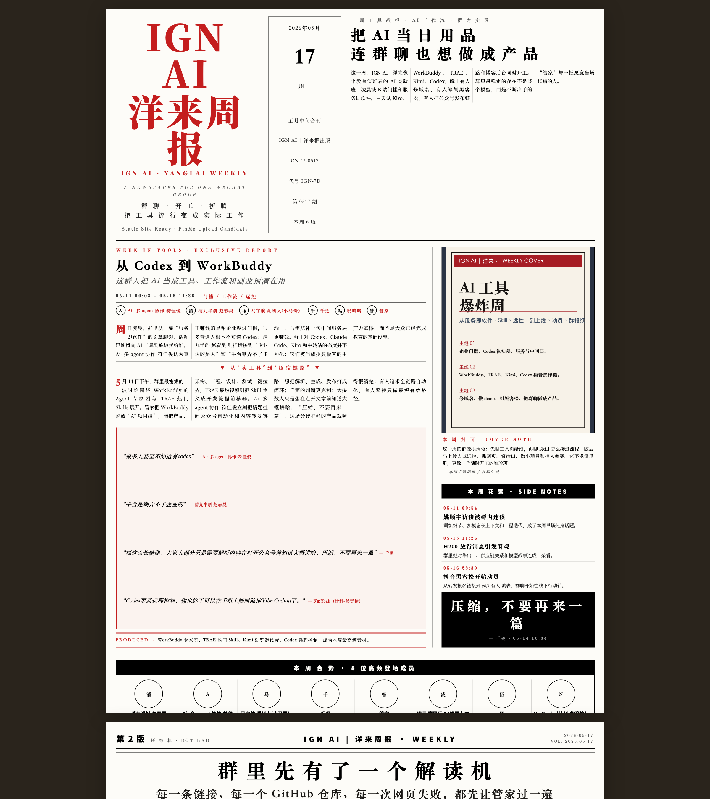

# wx-summary-skill

一个基于 `wx-cli` 的微信群聊摘要 skill，用来把“临时拉一段群聊做总结”变成一个可重复、可检查、可积累上下文的本地工作流。

它主要负责三件事：

1. 选择群聊
2. 选择时间范围
3. 生成文字摘要或本地报纸风网页日报

补充能力：

- 记住最近使用过的群
- 记住默认时间范围和输出模式
- 生成可追溯的本地分析材料
- 提供 bootstrap / doctor 自检入口

这个仓库只做本地提取、分析和渲染，不做部署服务。

## 学习声明

这是一个**仅供学习、研究和个人工作流实验**的开源项目。

请只在以下前提下使用：

- 你操作的是**自己的设备**
- 你登录的是**自己的微信账号**
- 你处理的是**自己有权访问或已获授权**的聊天数据
- 你的使用方式符合当地法律、平台条款和团队内部规范

本项目默认面向本地、可审计、可手动检查的使用场景，不鼓励把它用于未授权的数据采集、批量抓取或绕过权限控制的用途。

## 它和 `wx-cli` 的关系

这个仓库**不是**微信 CLI 本体，它是构建在 `wx-cli` 之上的摘要工作流。

- `wx-cli` 负责本机微信数据访问、命令行查询、会话读取和初始化
- `wx-summary-skill` 负责交互、状态记忆、时间范围解析、分析材料生成和摘要输出

如果你还没有准备好本机微信 CLI 环境，需要先把 `wx-cli` 装好，并在你自己的已登录桌面微信环境里完成初始化。

官方仓库：

- <https://github.com/jackwener/wx-cli>

对这个项目来说，判断依赖层是否就绪的标准很简单：

```bash
wx sessions --json
```

只要这条命令能返回真实 JSON，就说明 `wx-cli` 已经完成了它自己的会话/密钥访问准备，本项目就可以继续工作。

## 实际效果

下面这张图来自真实运行截图，展示的是 skill 交互输入效果：


示例：

- 群聊：`IGN AI | 洋来`
- 范围：`7d`
- 模式：`text`

示例输入：

```text
IGN AI | 洋来，7d，text
```

源文件保存在 [docs/assets/wx-summary-skill-ign-ai-yanglai-example-2026-05-18.png](docs/assets/wx-summary-skill-ign-ai-yanglai-example-2026-05-18.png)。

下面这张图是网页模式的旧版示意图。当前仓库默认网页模式已经切到人民日报式的报纸风网页日报，这张截图后续会更新：

[](https://ba40cc13.pinme.dev/)

在线预览：

- <https://ba40cc13.pinme.dev/>

## 快速开始

### 1. 克隆到本地 skill 目录

macOS / Linux:

```bash
git clone https://github.com/qianzhu18/wx-summary-skill.git "$HOME/.codex/skills/wx-summary-skill"
cd "$HOME/.codex/skills/wx-summary-skill"
```

Windows PowerShell:

```powershell
git clone https://github.com/qianzhu18/wx-summary-skill.git "$HOME\.codex\skills\wx-summary-skill"
Set-Location "$HOME\.codex\skills\wx-summary-skill"
```

### 2. 安装 Python 依赖

```bash
python3 -m pip install -r requirements.txt
```

如果你的机器上 `python` 就是 Python 3，也可以直接用 `python -m pip install -r requirements.txt`。Windows PowerShell 也可以用 `py -3 -m pip install -r requirements.txt`。

### 3. 安装 `wx-cli`

选一种方式即可。

`npm` 安装：

```bash
npm install -g @jackwener/wx-cli
```

macOS / Linux 安装脚本：

```bash
curl -fsSL https://raw.githubusercontent.com/jackwener/wx-cli/main/install.sh | bash
```

Windows PowerShell 安装脚本：

```powershell
irm https://raw.githubusercontent.com/jackwener/wx-cli/main/install.ps1 | iex
```

### 4. 在本机完成微信 CLI 初始化

这一步的目标不是“跑完某个项目脚本”，而是让你的本机微信环境真的能被 `wx-cli` 正常读取。

换句话说，这一步完成后你要看到的是：

```bash
wx sessions --json
```

返回真实 JSON。

macOS：

```bash
sudo codesign --force --deep --sign - /Applications/WeChat.app
open -a WeChat
sudo wx init
wx sessions --json
```

Windows PowerShell（管理员）：

```powershell
wx init
wx sessions --json
```

Linux：

```bash
sudo wx init
wx sessions --json
```

说明：

- 这一步由 `wx-cli` 负责完成它所需的本机会话/密钥访问准备
- 本项目本身**不单独实现**微信密钥提取逻辑
- 对本项目而言，只要 `wx sessions --json` 能正常返回，就说明依赖层已经准备好
- macOS 如果微信不在 `/Applications/WeChat.app`，请替换成你的实际路径
- Windows / Linux 请先确保桌面微信已打开并完成登录

### 5. 跑 bootstrap

macOS / Linux:

```bash
python3 scripts/bootstrap_skill.py
```

Windows PowerShell:

```powershell
py -3 scripts/bootstrap_skill.py
```

bootstrap 会：

- 自动创建 repo 本地配置（如果还没有）
- 检查 `wx` 是否可用
- 检查 `wx --version`
- 检查 `wx sessions --json`
- 输出下一步建议

只有在依赖层真的 ready 时，它才会给出可直接使用的状态。

### 5. 启动 skill

当 bootstrap 或 doctor 返回 `ready` 后，直接调用：

```text
$wx-summary-skill
```

## 首次使用建议

第一次正式跑，建议先用一个低风险群做一单短范围测试：

- 群聊：任选一个你确认有权限处理的群
- 时间：`1d`
- 模式：`text`

这样你可以先验证三件事：

- 群名搜索是否符合你的实际使用习惯
- 输出目录是否在你预期的位置
- 摘要结构是否满足你的日常工作流

## 平台说明

当前这套仓库按 `wx-cli` 的可用平台来设计辅助脚本和自检流程：

- macOS
- Linux
- Windows

Python 命令约定：

- macOS / Linux：`python3`
- Windows PowerShell：`py -3`
- 如果你的机器上 `python` 就是 Python 3，也可以自行替换

## doctor 和 bootstrap

这个仓库有两个面向落地的入口：

- `scripts/bootstrap_skill.py`
- `scripts/check_wechat_env.py`

区别：

- `bootstrap_skill.py` 更适合刚 clone 下来的第一次使用
- `check_wechat_env.py` 更适合排查环境问题

直接检查：

macOS / Linux:

```bash
python3 scripts/check_wechat_env.py
```

Windows PowerShell:

```powershell
py -3 scripts/check_wechat_env.py
```

doctor 会检查：

- `wx` 是否在 `PATH`
- `wx --version` 是否正常
- `wx sessions --json` 是否可读
- `~/.wx-cli/config.json` 和 `all_keys.json` 是否已经到位
- Windows 下 `%APPDATA%\Tencent\xwechat\config\*.ini` 能否推出真实 `db_storage`
- Windows 下是否落进了“手动写了 `db_dir`，但 `wx init` 仍在生成 `all_keys.json` 之前重跑自动探测”的已知卡点
- 当前 repo 是否已有本地配置
- 默认输出目录会写到哪里

## 这个项目会生成什么

`prepare_wechat_digest.py` 会生成：

- `raw/*.messages.json`
- `raw/*.stats.json`
- `analysis/*.analysis.json`
- `analysis/*.briefing.md`

`render_web_digest.py` 会生成：

- `<group_dir>/<since>_<until>.web.md`
- `<group_dir>/newspaper/<since>_<until>/story.json`
- `<group_dir>/newspaper/<since>_<until>/layout-plan.json`
- `<group_dir>/site/index.html`
- `<group_dir>/dist/index.html`
- `<group_dir>/history.json`

网页模式现在会走同一套多版报纸 renderer，所以你拿到的不只是摘要结果，还有可复查的 story/layout 中间产物和最终本地静态站点。

如果群目录下存在 `branding/site-icon.png`、`branding/site-icon.jpg` 之类的图标源文件，renderer 还会顺手生成 favicon、apple-touch icon，并把相应 `<link rel="icon">` 标签写进页面 head。可选的 `branding/site-branding.json` 还可以补 `theme_color`、`icon_public_url`、`apple_touch_icon_public_url`、`og_image_public_url`。

## 本地配置和状态

### Config

配置文件按以下顺序读取第一个存在的文件：

- `<project>/.wx-summary-skill/config.json`
- `${XDG_CONFIG_HOME:-$HOME/.config}/wx-summary-skill/config.json`
- `$HOME/.wx-summary-skill/config.json`

支持字段：

- `data_root`
- `self_wxid`（可选）
- `self_display`（可选）
- `wx_bin`（可选，默认 `wx`）

### State

状态文件按以下顺序读取第一个存在的文件：

- `<project>/.wx-summary-skill/state.json`
- `${XDG_CONFIG_HOME:-$HOME/.config}/wx-summary-skill/state.json`
- `$HOME/.wx-summary-skill/state.json`

状态里会保存：

- 最近使用过的群
- 默认时间范围
- 默认输出模式
- 默认文字摘要样式
- 默认网页摘要样式

查看当前合并后的状态：

```bash
python3 scripts/skill_state.py inspect
```

手动初始化配置：

```bash
python3 scripts/skill_state.py init-config --scope project --data-root ./wechat
```

Windows PowerShell:

```powershell
py -3 scripts/skill_state.py init-config --scope project --data-root .\wechat
```

保存一次会话默认值：

```bash
python3 scripts/skill_state.py save-session \
  --scope project \
  --group-id "44137533350@chatroom" \
  --group-name "Christina的AI+ 知识圈" \
  --duration-preset 7d \
  --summary-mode text \
  --text-style growth-brief-v1 \
  --web-style people-daily-v1
```

## 手动工作流

如果你想逐步执行底层脚本，可以按这个顺序：

### 1. 检查环境

```bash
python3 scripts/bootstrap_skill.py
```

### 2. 查看当前状态

```bash
python3 scripts/skill_state.py inspect
```

### 3. 解析时间范围

```bash
python3 scripts/resolve_time_range.py --preset 7d
```

自定义日期：

```bash
python3 scripts/resolve_time_range.py --since 2026-05-11 --until 2026-05-17
```

### 4. 生成分析材料

```bash
python3 scripts/prepare_wechat_digest.py \
  --chat "Christina的AI+ 知识圈" \
  --since 2026-05-11 \
  --until 2026-05-17 \
  --data-root "./wechat"
```

### 5A. 输出文字摘要

最终文字摘要建议写成：

```text
<group_dir>/2026-05-11_2026-05-17.text-summary.md
```

推荐结构见 [references/text-summary-format.md](references/text-summary-format.md)。

### 5B. 输出本地网页日报（报纸风）

```bash
python3 scripts/render_web_digest.py \
  --summary /abs/path/to/summary.json \
  --analysis /abs/path/to/analysis.json
```

更多格式说明：

- [references/summary-schema.md](references/summary-schema.md)
- [references/webpage-mode.md](references/webpage-mode.md)

## 仓库结构

```text
.
├── SKILL.md
├── LICENSE
├── README.md
├── agents/
│   └── openai.yaml
├── docs/
│   └── assets/
│       ├── wx-summary-skill-ign-ai-yanglai-example-2026-05-18.png
│       ├── wx-summary-skill-ign-ai-yanglai-webpage-example-2026-05-18.png
│       └── wx-summary-skill-usage-example-2026-05-18.png
├── .github/
│   └── workflows/
│       └── selftest.yml
├── references/
│   ├── setup-without-baoyu.md
│   ├── summary-schema.md
│   ├── text-summary-format.md
│   └── webpage-mode.md
└── scripts/
    ├── bootstrap_skill.py
    ├── check_wechat_env.py
    ├── prepare_wechat_digest.py
    ├── render_web_digest.py
    ├── resolve_time_range.py
    ├── selftest_repo.py
    └── skill_state.py
```

## 自测

本地 smoke test：

```bash
python3 scripts/selftest_repo.py
```

它会覆盖：

- 脚本可编译性
- bootstrap 路径
- 平台分支提示
- doctor 的关键恢复提示

GitHub Actions 里也会跑同一套基础自测。

## License

MIT. See [LICENSE](LICENSE).
